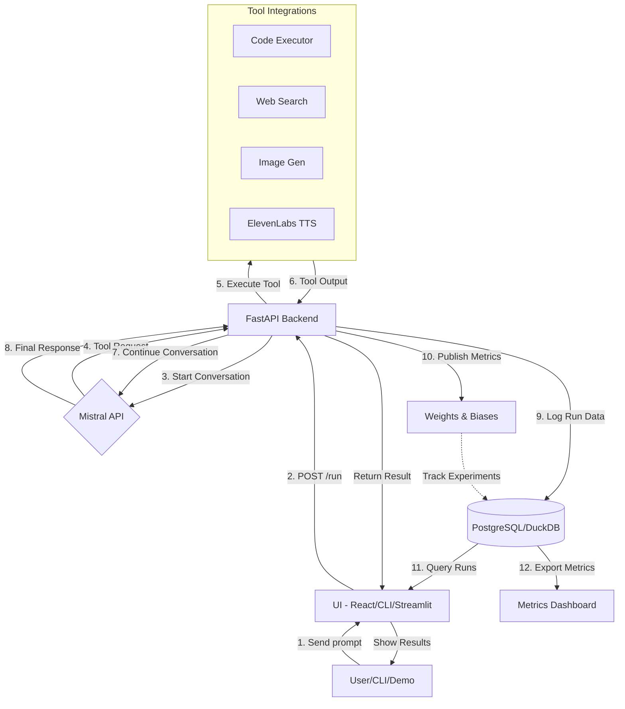

# AgentOps Studio – MVP Plan and Architecture

AgentOps Studio is an observability and experiment-tracking platform for Mistral-based AI agents. It logs every agent run (prompts, tool calls, memory state, etc.), computes metrics (tokens, latency, cost), and enables replay and deterministic diffing of runs.

## Overview

**Key Ideas:**
1. Capture all agent interactions and context (messages, tool outputs, memory snapshots, metadata) in a database
2. Use OpenTelemetry-style tracing to record token usage and costs for each step
3. Provide a UI/dashboard for browsing runs, metrics, and diffs
4. Optionally fine-tune and re-deploy models via W&B pipelines
5. Track usage of Mistral, ElevenLabs, cloud resources, etc., for cost/billing

**Core Components:** Mistral Agent API · OpenTelemetry-based logger · PostgreSQL/DuckDB store · FastAPI backend · React/Streamlit frontend · W&B/HF integration · CI/CD (GitHub Actions, Docker)

---

## 1. Integrations & APIs

| Integration | Purpose | Docs |
|---|---|---|
| **Mistral Agents & Chat API** | Launch agents and conversations, use built-in tools (code execution, search, vision, memory, etc.). Log each message, tool call, and memory state. | [Mistral Agents Intro](https://docs.mistral.ai/capabilities/agents/) |
| **Mistral Fine-tuning API** | Fine-tune Mistral models on custom data ($4 min/job + $2/mo storage). | [Fine-Tuning Docs](https://docs.mistral.ai/capabilities/function_calling/) |
| **Weights & Biases (W&B)** | Experiment tracking: log runs, metrics, charts, model artifacts. | [W&B API Docs](https://docs.wandb.ai/) |
| **Hugging Face Hub** | Store datasets or evaluation results. Integrate with HF Datasets/Spaces for leaderboards. | [HF Datasets](https://huggingface.co/datasets) |
| **ElevenLabs API** | Text-to-speech / voice interface for agents. Track usage (billed per character/minute). | [ElevenLabs API](https://elevenlabs.io/docs) |
| **Databricks REST API** | (Optional) Collect job logs or metrics via Databricks Jobs API. | [Databricks REST API](https://docs.databricks.com/api/workspace/jobs) |
| **Apache Airflow API** | (Optional) Agents triggering workflows via REST API or CLI. | [Airflow REST API](https://airflow.apache.org/docs/apache-airflow/stable/stable-rest-api-ref.html) |
| **NVIDIA Tools (TensorRT / Triton)** | (Optional) Convert Mistral to ONNX/TensorRT for fast local runs. | [GenAI-Perf](https://github.com/NVIDIA/GenerativeAIComputeBench) |

---

## 2. Architecture & Data Flow



### Data Flow Sequence

1. **User input** (prompt + parameters) → Backend
2. **Backend invokes** `client.beta.conversations.start(...)` on Mistral API
3. **Responses** returned with tool calls and detailed entries
4. **Backend captures** each entry: role, content, tool name, memory changes, metadata
5. **Tracer logs** each LLM call: prompt tokens, completion tokens, total tokens, cost
6. **Logs populate** database schema (Runs, Messages, ToolCalls, MemorySnapshots)
7. **Run summary** computed and logged to W&B/HF
8. **UI/dashboard** queries data for visualization and replay

### Execution Sequence

```
User/Dev → HTTP POST /run {agent_id, prompt, params}
         ↓
Backend  → Insert Run (id, agent_id, params, start_time)
         ↓
         → Start Conversation (agent_id, inputs)
         ↓
Mistral  → Response (assistant message + tool request)
         ↓
Backend  → Execute tool (if needed) → Tool output
         ↓
         → Continue Conversation (with tool output)
         ↓
         → Final response
         ↓
         → Insert all messages, toolcalls, memory
         ↓
         → Update Run (end_time, cost, tokens)
         ↓
         → Log metrics (tokens, cost, success_rate)
         ↓
User/Dev ← Return result (final answer)
```

---

## 3. Storage Schema

### Core Tables

**Runs**
- `run_id` (UUID, primary key)
- `agent_id` (String)
- `user_id` (String)
- `start_time`, `end_time` (DateTime)
- `status` (String)
- `total_tokens`, `total_cost` (Integer, Float)
- `config` (JSON)

**Messages (Entries)**
- `message_id` (UUID, primary key)
- `run_id` (UUID, foreign key)
- `role` (user/assistant/system)
- `content` (Text)
- `timestamp` (DateTime)
- `token_count` (Integer)
- `finish_reason` (String)

**ToolCalls**
- `call_id` (UUID, primary key)
- `run_id` (UUID, foreign key)
- `message_id` (UUID, foreign key)
- `tool_name` (String)
- `args`, `return_value` (JSON, Text)
- `latency_ms` (Integer)

**MemorySnapshots**
- `memory_id` (UUID)
- `run_id` (UUID, foreign key)
- `timestamp` (DateTime)
- `memory_json` (JSON)

**Diffs**
- `diff_id` (UUID)
- `run_id` (UUID, foreign key)
- `parameter_changed` (String)
- `before_output`, `after_output` (Text)
- `diff_json` (JSON)

**Evaluations**
- `eval_id` (UUID)
- `run_id` (UUID, foreign key)
- `metric_name` (String)
- `metric_value` (Float)

---

## 4. Replay & Deterministic Diff

A core feature is replay of any saved agent run to compare behavior.

**Process:**
1. Fetch original run record (inputs, config, seed)
2. Re-run conversation via Mistral API with same seed and config
3. Compare outputs token-by-token or via textual diff

**Example:**
```python
orig = db.query(Run).get(run_id)
resp_replay = mistral.client.beta.conversations.start(
    agent_id=orig.agent_id,
    inputs=orig.initial_messages,
    seed=0,
    temperature=orig.config["temperature"]
)
diff = compute_diff(orig.final_text, resp_replay.output_text)
```

**Determinism:** Fixed seed + minimal sampling (e.g., temperature=0) mitigates LLM stochasticity. Differences reveal non-determinism in tools or API versions.

---

## 5. Cost & Billing Tracking

- **Cost Formula:** `cost = (price per 1k tokens) × tokens used`
- **Tracked Costs:**
  - Mistral LLM calls
  - Tool costs (ElevenLabs TTS, etc.)
  - Fine-tuning fees ($4 min, $2/mo)
- **Dashboard Metrics:**
  - Total spend, cost per run
  - Cost breakdown by category (LLM vs. tools)
  - Cost vs. accuracy tradeoff charts

---

## 6. Evaluation & Metrics

Support logging arbitrary evaluation metrics per run:
- Success rate
- BLEU score
- Custom metrics (task-specific)
- Execution time
- Token efficiency

**Structured Log Example:**
```json
{
  "task_id": "123",
  "success": true,
  "response": "Answer text...",
  "tool_called": "search",
  "execution_time_ms": 1530,
  "tokens": 234,
  "cost_usd": 0.0012,
  "trace_id": "abc123"
}
```

All metrics visualized in UI (tables, charts) and shared to W&B/HF leaderboards.

---

## 7. Security & Privacy

- **Authentication:** OAuth or API keys for user access; Mistral/W&B/ElevenLabs keys in environment variables
- **Data Privacy:** Encrypt data at rest; hashed IDs in logs; minimal PII storage
- **Secure Execution:** Sandbox code execution (Docker)
- **Access Control:** Role-based authorization for runs
- **Compliance:** Enable EU Data Residency modes (ElevenLabs); respect GDPR/HIPAA
- **Network Security:** HTTPS/TLS; Vault or AWS Secrets Manager for secrets

---

## 8. CI/CD & Testing

### Testing Strategy
- **Unit Tests:** DB models, diff logic
- **Integration Tests:** Mock Mistral API, simulate conversations
- **API Tests:** Backend endpoints (/run, /replay)
- **External Service Mocks:** Mock W&B logging

### CI Pipeline
- Run tests and lint on each commit (Black, Flake8, ESLint)
- Build Docker images
- Deploy to dev cluster

### Deployment
- Dockerize all components
- `docker-compose.yml` for local demo (frontend, backend, DB)
- Optional Kubernetes manifest or Terraform scripts

---

## 9. MVP Scope & Priorities

### MUST-Have (Core Features)
| Feature | Category | Rationale |
|---|---|---|
| Agent Run Logging | Core | Capture prompts, messages, tool calls, memory |
| Cost & Token Tracking | Metrics | Estimate spend per run |
| Replay & Diff | Core | Compare behavior with parameter changes |
| Dashboard UI | Frontend | Browse runs, view details, charts |
| W&B Integration | Integration | Log metrics for traceability |
| Architecture Docs | Deliverable | Clear diagrams, README |

### Should-Have (Nice-to-Have)
- Memory snapshot viewer
- Multi-agent orchestration view
- Fine-tune loop (auto-collect failures)
- Databricks/Airflow hooks
- ElevenLabs voice output
- On-device quantization demo

---

## 10. Execution Plan (48h Timeline)

| Timeframe | Tasks |
|---|---|
| **Day 1 AM** | Plan & setup; initialize repo; DB schema; basic README |
| **Day 1 PM** | Implement POST /run API; logging; DB models |
| **Day 1 Eve** | Add replay & diff endpoint; text diff logic |
| **Day 2 AM** | Frontend MVP; list runs; select and view details |
| **Day 2 PM** | Add charts (tokens, cost); W&B integration |
| **Day 2 Eve** | Unit tests; auth; polish UI; demo prep |
| **Day 2 Night** | Rehearse demo; finalize CI/CD |

---

## 11. Repository Structure

```
AgentOps-Studio/
├── backend/
│   ├── main.py              # FastAPI app
│   ├── models.py            # SQLAlchemy models
│   ├── agentos_db.py        # DB session & schema
│   ├── mistral_client.py    # Mistral API wrapper
│   └── utils.py             # Replay & diff logic
├── frontend/
│   ├── App.jsx              # React app (or Streamlit)
│   ├── components/          # UI components
│   └── static/              # CSS, images
├── infra/
│   ├── docker-compose.yml
│   ├── Dockerfile
│   └── terraform/           # (optional) IaC scripts
├── tests/
│   ├── test_api.py         # API integration tests
│   ├── test_models.py      # Model tests
│   └── test_diff.py        # Replay/diff tests
├── scripts/
│   └── sample_agent.py     # Example usage
├── requirements.txt
├── README.md
└── LICENSE
```

---

## 12. Code Sketch

```python
# backend/utils.py – Core logic pseudocode

def start_run(agent_id, user_inputs, params):
    run_id = uuid4()
    run = Run(id=run_id, agent_id=agent_id, config=params, start_time=now())
    db.session.add(run)
    db.session.commit()
    
    # Start conversation
    response = mistral.client.beta.conversations.start(
        agent_id=agent_id, inputs=user_inputs, **params
    )
    
    # Log messages and tools
    for entry in response['conversation_entries']:
        msg = Message(
            run_id=run_id,
            role=entry['role'],
            content=entry['content'],
            tokens=entry.get('tokens', 0)
        )
        db.session.add(msg)
        
        # Log tool calls if present
        if entry.get('tool_execution'):
            tool = entry['tool_execution']
            tc = ToolCall(
                run_id=run_id,
                message_id=msg.id,
                tool_name=tool['tool_name'],
                args=tool['args'],
                result=tool['output']
            )
            db.session.add(tc)
    
    # Finalize run
    run.end_time = now()
    run.total_tokens = sum(m.tokens for m in run.messages)
    run.total_cost = calculate_cost(run.total_tokens, model=params['model'])
    db.session.commit()
    return run_id

def replay_run(run_id, new_params=None):
    orig = db.session.get(Run, run_id)
    params = orig.config.copy()
    if new_params:
        params.update(new_params)
    
    # Force deterministic seed
    params['seed'] = 0
    
    # Re-run conversation
    response = mistral.client.beta.conversations.start(
        agent_id=orig.agent_id,
        inputs=orig.initial_messages,
        **params
    )
    
    new_text = ''.join([e['content'] for e in response['conversation_entries']])
    diff = compute_diff(orig.final_text, new_text)
    
    # Save diff to DB
    diff_record = Diff(run_id=run_id, changed_params=params, diff=diff)
    db.session.add(diff_record)
    db.session.commit()
    return diff
```

---

## 13. Demo Script

1. **Intro:** "AgentOps Studio – Unified agent observability"
2. **Live Demo:** Run agent (e.g., "Travel Assistant") with web-search tool
3. **Show Logging:** UI displays conversation with tool outputs and trace spans
4. **Metrics Dashboard:** Bar charts (tokens/cost), table of runs, W&B integration visible
5. **Replay Feature:** Re-run with Temperature=0, show side-by-side diff
6. **W&B Integration:** Show project dashboard with logged metrics
7. **Recap:** Map features to hackathon criteria and prize alignment

---

## 14. Prize Alignment

| Track | Feature/Aspect |
|---|---|
| **Mistral AI** | Comprehensive use of Agents API; deep model instrumentation |
| **Hugging Face** | Best Agent Skills; detailed evaluation metrics/leaderboards |
| **W&B** | Continuous fine-tune loop; run metric logging |
| **ElevenLabs** | (Optional) TTS voice integration and cost tracking |
| **NYC – Tilde** | Novel architecture (replay/diff); modular, scalable design |
| **London – Jump** | Best use of data (token/cost analysis for insights) |

---

## 15. Tech Stack & Trade-offs

| Component | Choice | Rationale |
|---|---|---|
| **Backend** | Python 3.11 + FastAPI | Lightweight, async support, auto OpenAPI docs |
| **Database** | PostgreSQL (prod); DuckDB (demo) | SQL JOINs for analytics; DuckDB simpler for hacks |
| **Frontend** | React or Streamlit | React for control; Streamlit for speed |
| **Tracing** | OpenTelemetry | Auto LLM spans with minimal code |
| **Visualization** | Chart.js or Plotly | Easy, built-in to React/Streamlit |
| **CI/CD** | GitHub Actions + Docker | Native GitHub integration; reproducible builds |
| **Infrastructure** | Docker Compose (local); AWS/DigitalOcean (cloud) | Flexible deployment options |

---

## 16. Next Steps (Post-Hackathon)

- **Productization:** Multi-tenancy, RBAC, SaaS packaging
- **Extended Integrations:** LangChain, Autogen, other LLMs
- **Scalability:** Message queues, auto-scaling workers, search index
- **Analytics & Alerts:** Admin dashboard, SLO alerts, cost spike notifications
- **Community:** Open-source, plugin ecosystem
- **Data Pipelines:** Deeper Databricks/Airflow integration
- **Monetization:** Enterprise observability platform for agents

---
